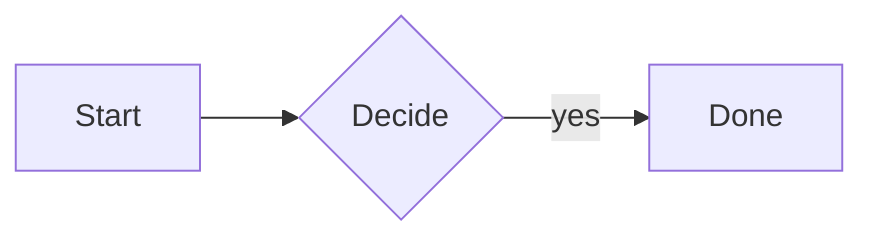
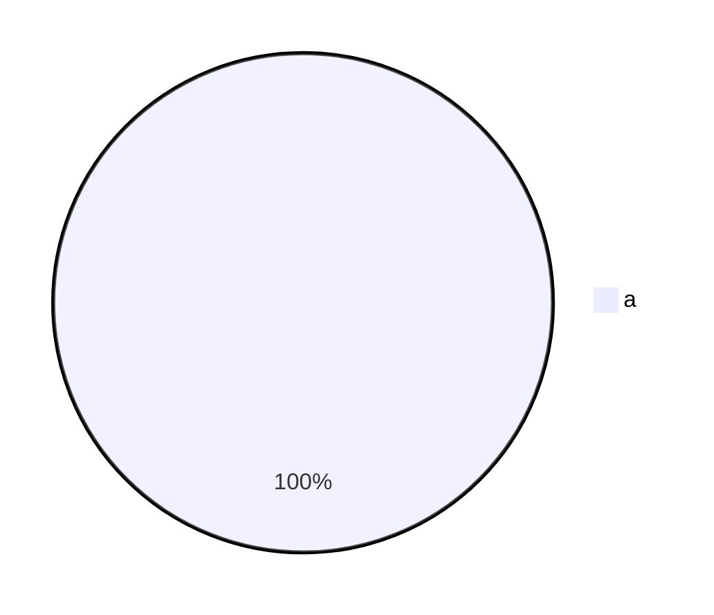

```mermaid
flowchart LR
    A[Start] --> B{Decide}
    B -->|yes| C[Done]
```

```MERMAID
sequenceDiagram
    A->>B: Hi
```


```mermaid title="ignored"
pie
    "a" : 1
```

```mermaid
```

~~~mermaid
graph TD; tilde-->fence
~~~
